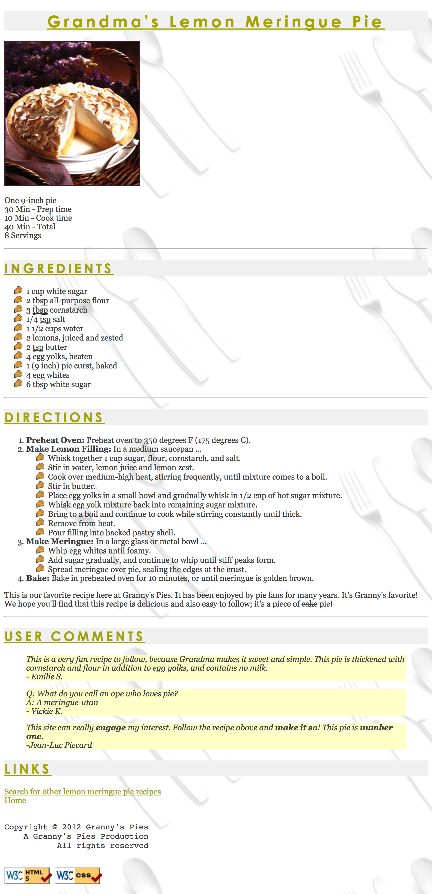

# Project 1 Recipe
This assignment tests your understanding of basic HTML and CSS. You will create several files related to a recipe website for a fictional pie company named Granny's Pies. You will need to create two files:
* pie.html: the web page (the content is provided in [starter code](pie.html)), which must match a particular specified appearance.
* recipe.css: the stylesheet for pie.html to achieve the desired appearance.

You must match in appearance the pie web page shown in the following screenshot: 

The width of the screenshot below is based on a browser window width of 1024px; if your screen is a different size, the width of your page may not exactly match. Any line breaks shown are done automatically by the browser, except ones that are clearly much narrower than the page width, such as the line "One 9-inch pie". You don't need to type in all of the text of the pie web page, only the HTML tags.

## Appearance and Behavior Details
The pie web page's title text should be Grandma's Lemon Meringue Pie.
* All headings on the page should use a foreground color of ```#A4A400``` (red=164, green=164, blue=0) and a background color of ```#F0F0F0``` (red=240, green=240, blue=240). The font families for headings are: ```Lucida Sans Unicode```, ```Helvetica```, ```Arial```, or any ```sans-serif``` font available on the system (in that order).
* The page's main heading is aligned to the center of the page body, and uses a ```22pt``` bold font.  Other headings on the page are left-aligned and appear in an 18pt normal font.
* All headings should be underlined.
* The overall page's body should have a white background. Text in the body should have a foreground color of ```#404040``` (red=64, green=64, blue=64) and use an ```11pt``` font.
* The font families for page text are ```Georgia```, ```Garamond```, or any ```serif``` font available on the system.
* Any links on the page should use the color ```#A4A400``` (red=164, green=164, blue=0), matching the color of the page headings.
* In the Ingredients list, the underlined words **"tbsp"** and **"tsp"** are abbreviations for **"tablespoons"** and **"teaspoon"** respectively. When the user hovers the mouse over these abbreviations, the full word should appear as a **tooltip**.
* At the end of the Directions, the deleted word "cake" with a strike-out line through it is replaced by the word "pie".
* After the Links section there is a short copyright notice that appears as a section of pre-formatted text in a monospace font. The text is spaced such that the last letter lines up on horizontally for each of the three lines.
* The names of the four major steps of the recipe directions (such as "Preheat Oven") are strongly emphasized.
* The quotations from the users appear in an italic font as indented blocks with background color ```#FFFFA8``` (red=255, green=255, blue=168). Some words in the last quote are bolded for emphasis.
The picture of the pie, pie icon, and background image are provided with this assignment. The page bottom has four links. The "Home" link should go to your school home page. The "Search for other lemon meringue pie recipes" text, "W3C HTML5" button, and "W3C CSS" button should link to the following web pages, respectively:
  * http://www.google.com/search?q=lemon+meringue+pie+recipe&start=10
  * http://validator.w3.org/check/referer
  * http://jigsaw.w3.org/css-validator/check/referer

* All other decisions about styling on the page are left to the web browser.  Any styles mentioned previously that are the same as browser defaults do not have to be explicitly included in your CSS style sheet.  
* In addition to the previous required features, you must also complete at least two (2) of the following additional requirements in your pie page. These are features that may have not been covered in detail in lecture; you will have to explore your resources such as your textbook, lecture slides, or online references to learn how to complete these features.  If you want to complete more than two of the extra features below, that is fine, but only two are required.
  * Background: Set the overall page to use a background image of: silverware.jpg. The image should repeat in both directions across the page and should not move when the page is scrolled.
  * Pie bullet: Set all bulleted lists of items on the page to use an image for their bullet icon rather than the normal black circle. Use the following image: pie-icon.gif
  * Wide headings: Place 0.25em horizontal spacing between neighboring letters in all headings on the page.
  * Tight heading background: Make it so that the gray background behind the headings on the page is only behind the text itself, not stretched across the entire width of the page.

Near the top of your HTML file, put a comment saying which extra features you have completed. The screenshot includes the expected output for the extra features.
As much as possible, you should implement these changes by modifying your CSS code rather than your HTML. Some of the CSS properties necessary will not have been covered in class, so you must learn them yourself. Try using the textbook or Google.  There are some good HTML and CSS references such as the following sites:
  * http://www.w3schools.com/tags/default.asp
  * http://www.w3schools.com/cssref/default.asp

## Implementation
* You need to make your page pass the W3C HTML5 validator with no errors (a green bar). (Your page is fine as long as you see the green bar and text "This document was successfully checked as HTML5!")  Choose appropriate HTML tags to match the structure of the content on the page. Do not express style information in HTML with inline styles or presentational HTML tags such as ```<b>``` or ```<font>```. You may not use any HTML tables in your pie.html page.
* You only need to worry about your page's appearance in standards-compliant browsers such as Firefox or Chrome. You will not be tested in Microsoft Internet Explorer or other browsers that do not comply to web standards.
* Express all stylistic information on the page using CSS defined in recipe.css. Part of your grade comes from expressing your CSS concisely and without unnecessary or redundant styles. For example, if the page uses the same color or font family for multiple elements on the page, you must group those elements into a single CSS rule, so that it would be possible to change the page's color/font by modifying a single place in the CSS file. Outside of extra features, do not use HTML or CSS constructs that have not been discussed in lecture or the slides, through Chapters 2-3 of the textbook.
* You may use HTML class and id attributes to target elements for styling. Do not overuse such attributes in your HTML unnecessarily. If there is already a suitable tag for representing a given piece of content, favor the use of that tag rather than a less appropriate tag with a class or id attached for styling purposes.
Format your HTML and CSS nicely so that it is as readable as possible, similarly to the examples shown in class. Also place a comment header in each file containing your name and a brief description of the assignment and the file's contents. You must properly use whitespace and indent your HTML and CSS code following examples shown in class. To keep line lengths manageable, do not place more than one block element on the same line or begin any block element past the 100th character on a line.
