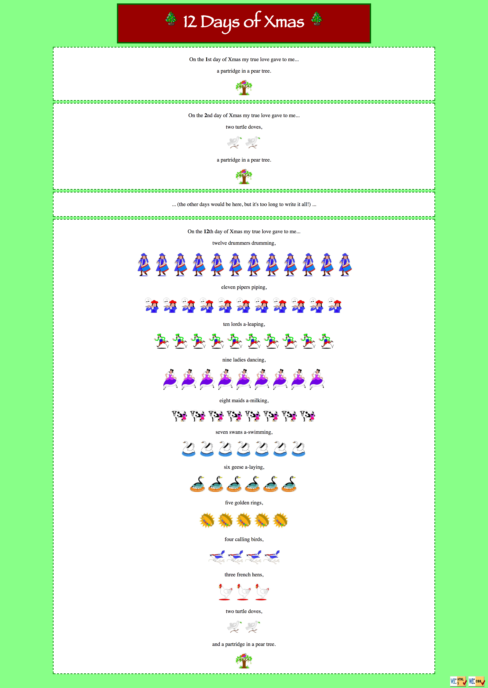

# Basic PHP
Write a page that displays the complete [lyrics](https://en.wikipedia.org/wiki/The_Twelve_Days_of_Christmas_(song))
of the song, "12 Days of Xmas," along with displaying images
for each of the gifts given on each day. Start from the
template in the following file: [12days.html](12days.html)

The page already has the correct appearance, but the code is
long and redundant. Modify the page to use PHP code to remove
this redundancy. The last of the 12 days should look like the following:


## Steps
We suggest you code this page by following these incremental
steps:
* For each day # N of Xmas, show day N's gift image once,
  with no text under each image.
* For each day # N of Xmas, (show day N's down to day 1's)
  gift image once each.
* For each day # N of Xmas, show (day N's down to day 1's)
  gift image N times each.
* Add the text labels such as "Three French hens" under each
  gift's image(s).

There are some stylistic aspects of the page that you should be careful about:
* You should minimize the use of print statements and should
  never print any HTML tags.
* Ideally your PHP code should have appropriate indentation so
  that if the user chooses to View Source in the browser, the
  HTML source output will be readable.
* You should find a way in your PHP code to elegantly represent
  the gift descriptions such as "three French hens" without lots
  of repeated text, code, or ```if/else``` statements.

Your finished page should look like the following:

